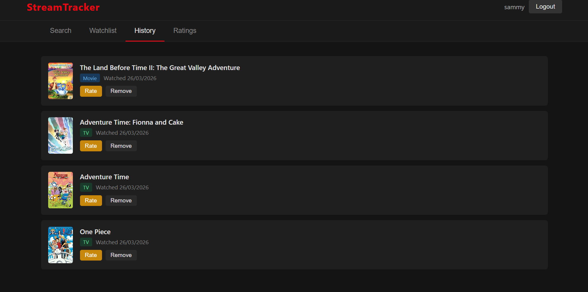

# StreamTracker

A simple TV and movie tracking app. Search for movies and shows, manage your watchlist, track your watch history, and leave ratings.

## Screenshots





## Stack

- **Frontend:** Vanilla HTML/CSS/JS served via Nginx
- **Backend:** Python/Flask REST API with JWT auth
- **Database:** PostgreSQL
- **Media data:** [TMDB API](https://www.themoviedb.org/)

## Running

**Requirements:** Docker and Docker Compose

1. Clone the repo
2. Copy the env file and fill in your values:
   ```bash
   cp .env.example .env
   ```
3. Start everything:
   ```bash
   docker compose up
   ```

- Frontend: http://localhost:3000
- API: http://localhost:5000

## Stopping

```bash
docker compose down
```

> **Note:** Add `-v` to also wipe the database: `docker compose down -v`

## Environment Variables

Copy `.env.example` to `.env` and set:

| Variable | Description |
|---|---|
| `TMDB_API_KEY` | Your API key from [themoviedb.org](https://www.themoviedb.org/settings/api) |
| `SECRET_KEY` | Flask secret key |
| `JWT_SECRET_KEY` | JWT signing key |
| `POSTGRES_*` | Database credentials |
