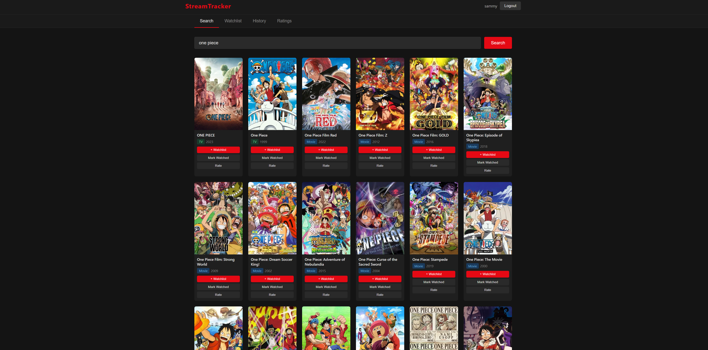
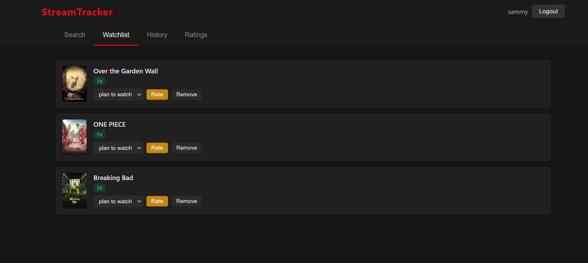
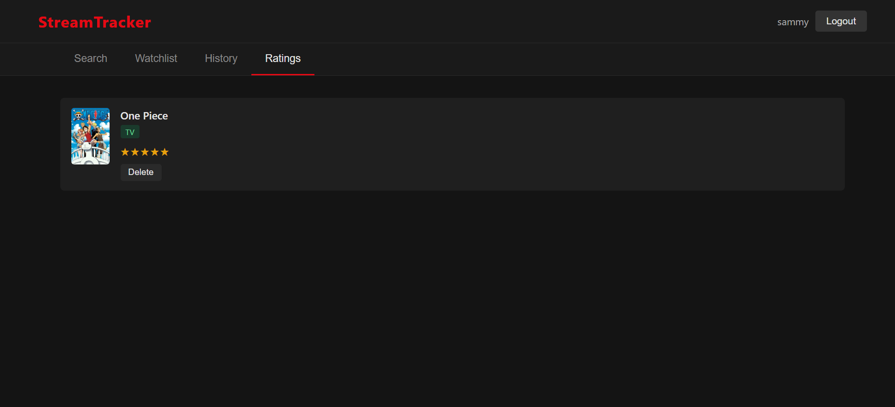

# StreamTracker

A simple TV and movie tracking app. Search for movies and shows, manage your watchlist, and leave ratings.

By [Samantha Hill](https://samanthahill.dev)

## Live Demo

[https://stream-tracker-sh.vercel.app/](https://stream-tracker-sh.vercel.app/)

## Screenshots







## Deployment

- **Frontend:** Hosted on [Vercel](https://vercel.com)
- **Backend:** Hosted on [Render](https://render.com)

## Stack

- **Frontend:** Vanilla HTML/CSS/JS served via Nginx
- **Backend:** Python/Flask REST API with JWT auth
- **Database:** PostgreSQL with Alembic migrations
- **Media data:** [TMDB API](https://www.themoviedb.org/)

## Project Structure

```
.
├── frontend/           # Static frontend (HTML/CSS/JS)
│   ├── index.html
│   ├── style.css
│   └── app.js
├── backend/
│   ├── app.py          # Flask app entry point
│   ├── config.py       # App configuration
│   ├── models/         # SQLAlchemy models
│   ├── routes/         # API route blueprints
│   ├── services/       # Business logic / TMDB client
│   └── migrations/     # Alembic migration files
└── docker-compose.yml
```

## Getting a TMDB API Key

StreamTracker uses [The Movie Database (TMDB)](https://www.themoviedb.org/) for movie and TV data. The API is free.

1. Create an account at [themoviedb.org](https://www.themoviedb.org/signup)
2. Go to **Settings → API** and request an API key (choose "Developer")
3. Copy the **API Key (v3 auth)** — that's the value for `TMDB_API_KEY`

## Running

**Requirements:** Docker and Docker Compose

1. Clone the repo:
   ```bash
   git clone https://github.com/your-username/streamtracker.git
   cd streamtracker
   ```
2. Copy the env file and fill in your values:
   ```bash
   cp .env.example .env
   ```
3. Start everything:
   ```bash
   docker compose up
   ```

Database migrations run automatically on first startup.

- Frontend: http://localhost:3000
- API: http://localhost:5000

## Stopping

```bash
docker compose down
```

> **Note:** Add `-v` to also remove the database volume: `docker compose down -v`

## Environment Variables

Copy `.env.example` to `.env` and set:

| Variable | Description | Example |
|---|---|---|
| `TMDB_API_KEY` | API key from [themoviedb.org](https://www.themoviedb.org/settings/api) | `abc123...` |
| `SECRET_KEY` | Flask secret key | `change-this-secret-key` |
| `JWT_SECRET_KEY` | JWT signing key | `change-this-jwt-key` |
| `POSTGRES_USER` | Database username | `streamtracker` |
| `POSTGRES_PASSWORD` | Database password | `changeme` |
| `POSTGRES_DB` | Database name | `streamtracker` |
| `DATABASE_URL` | Full connection string | `postgresql://user:pass@db:5432/dbname` |
